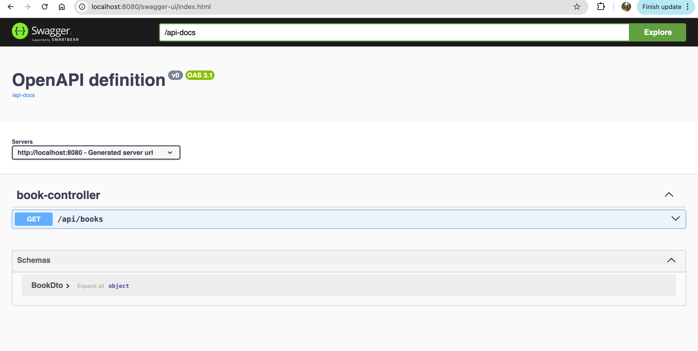

# Getting Started

### Reference Documentation
Libraries and Build Tools Used:

* [Official Gradle documentation](https://docs.gradle.org)
* [Spring Boot Gradle Plugin Reference Guide](https://docs.spring.io/spring-boot/3.4.1/gradle-plugin)
* [Spring Web](https://docs.spring.io/spring-boot/3.4.1/reference/web/servlet.html)
* [Spring Boot DevTools](https://docs.spring.io/spring-boot/3.4.1/reference/using/devtools.html)
* [Spring Data JPA](https://docs.spring.io/spring-boot/3.4.1/reference/data/sql.html#data.sql.jpa-and-spring-data)
* Swagger Open API

### TODOS:
1. Get List of all the Books in the Store []
2. Add Book to the Store[ ]
3. Add List of Books to the store []
4. Flyway addition for Db scripts []
5. Delete book by Admin []
6. Repo testing []
7. Containerize application and deploy in render []

Documentation so far: 

